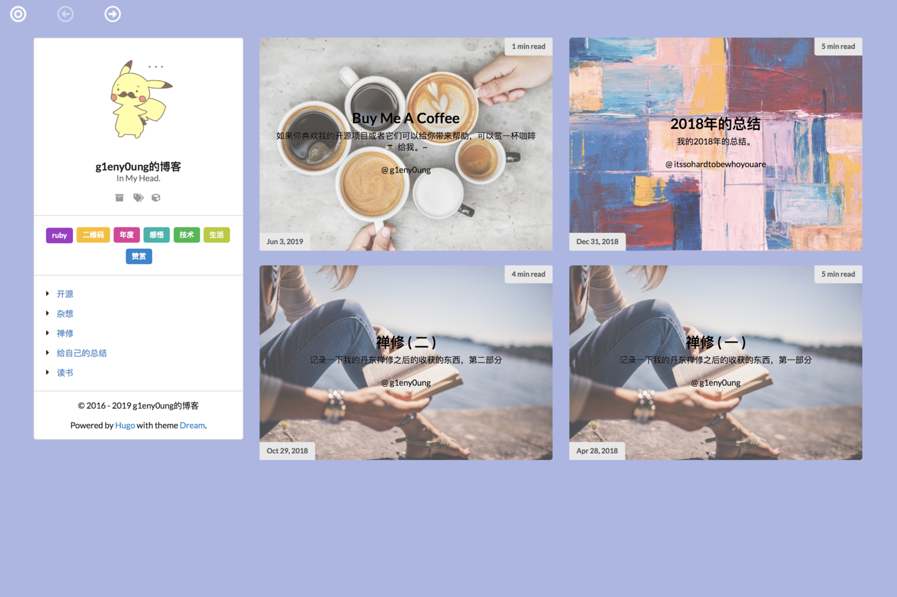

# :seedling: hugo-theme-dream

Dream is a [Hugo](https://gohugo.io/) theme. I build it for [my blog](http://g1eny0ung.site).

The main features is full page flip and random color views ~.



All tags of this theme:

* flip
* colorful
* i18n
* blog
* disqus
* google-analytics
* responsive
* copyright
* avatar
* motto
* sociallinks
* creative
* personal

## Documentation

[http://g1eny0ung.site/hugo-theme-dream](http://g1eny0ung.site/hugo-theme-dream)

## Installation

Go to your blog folder, and:

```
cd themes
git clone https://github.com/g1eny0ung/hugo-theme-dream.git dream
```

Then open your `config.toml`, edit to `theme = "dream"` and save.

## Publish

View [hugo hosting-and-deployment](https://gohugo.io/hosting-and-deployment/)

## License

MIT © [g1eny0ung](https://github.com/g1eny0ung)
